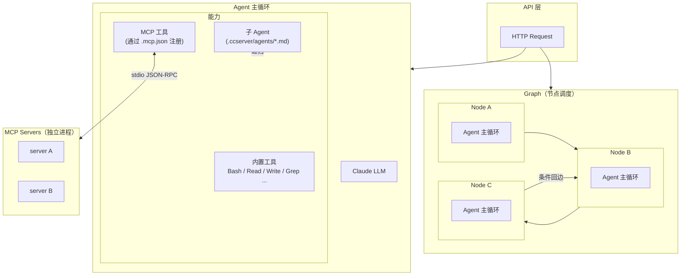

# CCServer — 将 Claude Code 包装成可部署的 Agent 服务

[English](README_EN.md) | 简体中文

> **这不是 Claude Code 的源码。这不是 Claude Code 的源码。这不是 Claude Code 的源码。** 重要的事情说三遍
>
> CCServer 起源于一个学习项目——通过拦截 Claude Code 发往 Anthropic API 的真实请求，分析其 system prompt、工具定义、消息结构等参数，推测内部实现机制并从零复现（感谢 [shareAI-lab/learn-claude-code](https://github.com/shareAI-lab/learn-claude-code) 的分析与研究）。在此基础上去掉 CLI 外壳，将核心能力改造成可独立部署的 Agent 服务，支持 HTTP API、SSE 流式、WebSocket 和终端交互界面。
>
> ⚠️ **项目仍在早期阶段，仍有部分 Claude Code 机制未完全兼容，可能存在 bug，但会持续维护迭代。** 欢迎提 Issue 或 PR。

---

## 适用场景

使用 Claude Code 一段时间后会发现，很多 Agent 项目根本不需要写代码——写好 prompt、配几个 MCP 工具，一个功能就搭起来了。但 Claude Code 本身是 CLI 工具，强依赖终端，某些场景下会有些局限：

- 想把 Agent 能力封装成接口，接入 Web 应用或自动化流水线
- 想统一管理 prompt、MCP 配置、agent 定义，作为一个服务运行
- 某些交互场景下，CLI 方式实现起来比较啰嗦

如果你也有类似需求，可以试试这个项目。

如果业务流程相对固定，还可以试试 **Graph 模式**把多个 Agent 节点编排起来——每个节点是一个完整的 Claude Agent，节点间按边执行，支持条件回边，适合需要多步骤协作或循环重试的场景。

---

## 快速开始

```bash
conda activate ccserver
uv pip install -r requirements.txt
export ANTHROPIC_API_KEY=your_key
```

项目有四个入口，分两类：

**独立运行（无需其他服务）**

```bash
# 后端 API 服务（HTTP / SSE / WebSocket）
python server.py

# 终端直连模式（不经过 server.py，直接调用 Agent）
python tui.py
```

**客户端（需先启动 server.py）**

```bash
# Gradio 图形界面
python clients/gui.py

# HTTP 终端界面（用于测试接口）
python clients/tui_http.py
```

> 推荐使用 [`just`](https://github.com/casey/just) 管理常用命令：`just api` / `just tui` / `just gui` / `just tui-http`
>
> 安装 just：`brew install just`（macOS）/ `apt install just`（Linux）/ `winget install Casey.Just`（Windows）

---

## Claude Code 内部实现推测

以下是通过拦截接口调用参数后，对 Claude Code 内部机制的推测性还原。**均为推测，非官方信息。**

### Agent 循环

Claude Code 的核心是一个标准的 tool_use 循环，没有魔法：

```
用户输入
  → 构建 messages 列表（含历史）
  → 调用 Anthropic API（messages + tools + system）
  → stop_reason == "tool_use"  → 执行工具 → 追加 tool_result → 继续
  → stop_reason == "end_turn"  → 输出文本 → 等待下一轮用户输入
```

### System Prompt 结构

System prompt 并非一个大字符串，而是一个 **`content` 块数组**（`List[dict]`），分多段注入：

- **身份声明**：Claude 是什么，基本行为准则
- **工具说明**：每个工具的用途和使用规范（与 `tools` 字段分离，用自然语言补充说明）
- **工作流**：任务执行的思考步骤与流程规范
- **环境注入（reminders）**：每轮用户消息前动态追加——当前时间、工作目录、系统信息、CLAUDE.md 内容、权限设置等

### 工具定义

Claude Code 的内置工具（Bash、Read、Write、Edit、Glob、Grep 等）通过标准 `tools` 参数传入，定义方式与普通 tool_use 完全相同。工具描述非常详细，包含使用注意事项和反例，用来引导模型选择正确工具和参数。

### 上下文压缩

对话超长时，Claude Code 会调用一次独立的 LLM 请求生成摘要，将历史消息替换为压缩后的摘要块，保留最近若干轮的完整消息。压缩前的完整对话会存档（对应本项目的 `transcripts/`）。

### 子代理（Subagent）

Claude Code 通过特殊工具信号派生子代理，子代理拥有独立的 messages 列表和工具集，运行结束后将结果作为 tool_result 返回给父代理。子代理不共享父代理的消息历史，最大嵌套深度有限制。

### 技能（Skills）与 CLAUDE.md

- **CLAUDE.md**：在每轮请求前通过 reminders 注入到 system prompt，作为项目级上下文
- **Skills**：按需加载的 Markdown 文档，通过工具调用注入到消息流中，而非预先放入 system prompt——这是为了节省 token

### 会话持久化

每条消息以 JSONL 格式追加写入磁盘，crash 后可从断点恢复。每个会话有独立的沙箱工作目录，Agent 的文件操作限制在该目录内。

---

## 项目结构

```
ccserver/                   # 项目根目录
├── server.py               # 后端服务（HTTP / SSE / WebSocket）
├── tui.py                  # 终端直连模式（无需 server.py）
├── clients/
│   ├── gui.py              # Gradio 图形界面（需先启动 server.py）
│   └── tui_http.py         # HTTP 终端界面（需先启动 server.py）
├── Justfile                # 常用命令（just api / tui / gui / tui-http）
├── requirements.txt        # 依赖声明
└── ccserver/               # 源码包
    ├── main.py             # AgentRunner 公共入口
    ├── agent.py            # Agent 和 AgentContext 核心
    ├── session.py          # Session、TaskManager、SkillLoader
    ├── factory.py          # AgentFactory
    ├── config.py           # 全局配置
    ├── compactor.py        # 对话压缩
    ├── log.py              # 日志配置
    ├── model/              # 模型适配器（ModelAdapter / AnthropicAdapter）
    ├── prompts_lib/        # 提示词拼接库（多 lib 支持）
    │   ├── base.py         # PromptLib 基类
    │   ├── adapter.py      # 自动扫描注册入口
    │   └── cc_reverse/     # cc_reverse 系列实现
    ├── tools/              # 内置工具集
    ├── core/emitter/       # 事件发射器（TUI / SSE / WebSocket）
    ├── mcp/                # MCP 客户端管理
    ├── storage/            # 存储适配器
    └── pipeline/           # Pipeline Graph 执行引擎
```

---

## 核心模块

### Agent（`ccserver/agent.py`）

统一的根代理 / 子代理类，通过构造参数区分：

- `persist=True`：根代理，消息持久化到磁盘
- `persist=False`：子代理，消息保存在内存中，会话结束后丢弃

**核心循环：**

```
消息列表 → LLM 调用 → 收集响应 → 检查 stop_reason
  → tool_use：执行工具 → 追加结果 → 继续循环
  → 其他（end_turn）：提取文本 → 返回
```

**子代理递归：** `spawn_child()` 生成子代理，最大嵌套深度 `MAX_DEPTH`（默认 5）。

---

### Session（`ccserver/session.py`）

每个会话拥有独立的工作目录沙箱：

```
sessions/
└── {session_id}/
    ├── workdir/            # 代理操作的沙箱目录
    ├── messages.jsonl      # 消息历史（一行一条）
    └── transcripts/        # 压缩前的完整对话存档
```

集成组件：
- **TodoManager**：最多 20 项任务，状态为 `pending` / `in_progress` / `completed`
- **SkillLoader**：从 `./skills/*/SKILL.md` 加载技能文档

---

### Prompt Lib（`ccserver/prompts_lib/`）

提示词拼接系统，支持多种 lib 类型和版本。每个 lib 控制以下拼接点：

| 方法 | 时机 | 是否必须实现 |
|------|------|------------|
| `build_system()` | agent 创建时，构建 system prompt | 是 |
| `build_user_message()` | 每条用户消息追加前 | 否 |
| `build_compact_messages()` | 对话压缩完成后 | 否 |
| `build_skill_catalog()` | 生成注入消息的技能目录文本 | 否 |
| `build_command_message()` | `/command` 调用包装为 content block | 否 |
| `patch_tool_schemas()` | 工具 schema 列表后处理 | 否 |

通过 `CCSERVER_PROMPT_LIB` 环境变量切换，默认使用 `cc_reverse:v2.1.81`。

**自定义 Prompt Lib：**

**第一步**：在 `prompts_lib/<lib_name>/<version>/lib.py` 中继承 `PromptLib`：

```python
from prompts_lib.base import PromptLib

class MyLibV100(PromptLib):

    def build_system(self, session, model, language, cch="",
                     injected_system=None, append_system=True, is_spawn=False) -> list:
        """
        构建 system prompt，返回传给 Anthropic API 的 content block 列表。
        - session: 当前会话对象
        - model: 使用的模型名
        - language: 响应语言
        - cch: 平台标识（如 "vscode"）
        - injected_system: 外部注入的 system 文本（来自 CCSERVER_SYSTEM_FILE）
        - append_system: True=追加到末尾，False=替换默认 system
        - is_spawn: 是否为子代理
        """
        return [{"type": "text", "text": "你是一个助手。"}]

    def build_user_message(self, text, session, context) -> list:
        """
        包装每条 user 消息，结果直接作为 message["content"]。
        context 字段：
        - is_first: 是否为本会话第一条用户消息
        - skills_override: None=使用全局 skills，[]= 无 skill，[str]=指定名称列表
        - hook_context: UserPromptSubmit hook 附加的上下文文本
        """
        return [{"type": "text", "text": text}]

    def build_compact_messages(self, summary, transcript_ref) -> list:
        """
        压缩完成后写回 history 的消息格式，需返回 [user消息, assistant消息]。
        - summary: LLM 生成的对话摘要
        - transcript_ref: 存档文件路径（供溯源）
        """
        return [
            {"role": "user",      "content": f"[摘要]\n{summary}"},
            {"role": "assistant", "content": "已了解，继续。"},
        ]

    def build_skill_catalog(self, skills) -> str:
        """
        将 skill 元数据列表格式化为注入消息的目录文本。
        skills 每项含 name / description / location 字段。
        返回空字符串表示不注入。
        """
        return "\n".join(f"- {s['name']}: {s['description']}" for s in skills)

    def build_command_message(self, cmd_info, session, history) -> list:
        """
        将 /command 调用包装为 content block 列表。
        cmd_info 字段：name / args / stdout / body
        """
        return [{"type": "text", "text": f"/{cmd_info['name']} {cmd_info.get('args', '')}"}]

    def patch_tool_schemas(self, schemas) -> list:
        """
        对工具 schema 列表做后处理，可替换工具描述文本。
        schemas 每项含 name / description / input_schema 字段。
        返回修改后的列表。
        """
        return schemas
```

> 除 `build_system()` 外，其余方法均有基类默认实现，按需覆盖即可。

**第二步**：在 `prompts_lib/adapter.py` 末尾注册：

```python
from prompts_lib.my_lib.v1_0_0.lib import MyLibV100
register("my_lib:v1.0.0", MyLibV100())
```

**第三步**：通过环境变量启用：

```bash
CCSERVER_PROMPT_LIB=my_lib:v1.0.0 python server.py
```

> 目录名中的点号不能作为 Python 包名，目录用下划线（`v1_0_0`），lib_id 保留点号（`v1.0.0`）。

---

### 内置工具（`ccserver/tools/`）

| 工具名 | 功能 |
|--------|------|
| Bash | 执行 shell 命令，支持超时和后台运行 |
| Read | 读取文件（带行号），支持 offset / limit |
| Write | 写入或覆盖文件 |
| Edit | 精确字符串替换 |
| Glob | 文件模式匹配，按修改时间排序 |
| Grep | 正则表达式搜索，返回行号和内容 |
| Compact | 手动触发对话压缩 |
| Agent | 派生子代理处理复杂任务（按需注册，取决于 agent catalog） |

> **注意：** Claude Code 内置了一批专用 subagent（`general-purpose`、`Explore`、`Plan`、`claude-code-guide`、`code-reviewer` 等），这些内置 subagent 目前在 CCServer 中**尚未实现**，敬请期待。你可以通过在 `.ccserver/agents/` 目录下添加 `*.md` 文件来自定义同名 subagent，作为临时替代。
| TaskCreate | 创建任务 |
| TaskUpdate | 更新任务状态 |
| TaskGet | 获取任务详情 |
| TaskList | 列出所有任务 |
| AskUserQuestion | 向用户提问，等待回答后继续 |
| WebSearch | 联网搜索（需传入 client） |
| WebFetch | 抓取网页内容（需传入 client） |

**扩展工具：** 继承 `BaseTool`，实现 `name`、`description`、`params`、`run()` 即可。

---

### 上下文压缩（`ccserver/compactor.py`）

三级压缩策略，自动管理长对话的 token 消耗：

| 级别 | 触发方式 | 方式 |
|------|----------|------|
| micro | 每轮自动 | 截断旧工具结果内容，保留最近 `KEEP_RECENT` 条完整 |
| 阈值检测 | 超过 `THRESHOLD` 字符 | 触发完整 LLM 压缩 |
| LLM 压缩 | 手动或阈值 | 调用 Claude 生成摘要，存档完整对话到 transcripts |

---

### 事件系统（`ccserver/core/emitter/`）

统一的 `BaseEmitter` 接口，支持多种输出后端：

| 实现类 | 用途 |
|--------|------|
| TUIEmitter | 彩色终端输出 + 加载动画 |
| SSEEmitter | 异步队列缓冲，Server-Sent Events |
| CollectEmitter | 内存收集，HTTP 非流式响应 |

**事件类型：** `token` / `tool_start` / `tool_result` / `done` / `compact` / `error`

---

## API 接口（`server.py`）

### 会话管理

```
POST   /sessions                    创建会话（可指定 session_id）
GET    /sessions                    列出所有会话
GET    /sessions/{session_id}       获取会话元数据
```

### 对话

```
POST   /chat                        阻塞式请求，返回完整响应
GET    /chat/stream                 SSE 流式响应
WS     /chat/ws/{session_id}        WebSocket 双向通信
```

**请求格式：**

`session_id` 通过 Header 传递，不传则自动创建新会话：

```http
POST /chat
X-Session-Id: <session_id>

{"message": "帮我写一个 hello world"}
```

**SSE 事件格式：**
```json
{"type": "token",       "content": "部分文本"}
{"type": "tool_start",  "tool": "Bash", "preview": "ls -la"}
{"type": "tool_result", "tool": "Bash", "output": "..."}
{"type": "done",        "content": "完整最终文本"}
{"type": "error",       "message": "错误信息"}
```

---

## 终端界面（`tui.py`）

直连 Agent，无需启动 `server.py`：

```bash
python tui.py
# 或
just tui
```

内置命令：

| 命令 | 说明 |
|------|------|
| `/clear` | 清空当前会话消息 |
| `/session <id>` | 切换到指定会话 |
| `/sessions` | 列出所有会话 |
| `/workdir` | 显示当前工作目录路径 |

---

## 技能系统

在 `./skills/` 目录下创建子目录，添加 `SKILL.md` 文件即可注册技能：

```markdown
---
name: my-skill
description: 技能的简要描述
tags: [tag1, tag2]
---

# 技能内容

详细的技能说明和使用方式...
```

代理可通过 `LoadSkill` 工具按需加载技能内容。

---

## 配置（`ccserver/config.py`）

所有配置均支持 `CCSERVER_*` 环境变量覆盖。

| 配置项 | 环境变量 | 默认值 | 说明 |
|--------|----------|--------|------|
| `MODEL` | `CCSERVER_MODEL` | `claude-sonnet-4-6` | 使用的 Claude 模型 |
| `THRESHOLD` | `CCSERVER_THRESHOLD` | `50000` | 触发完整压缩的字符数阈值 |
| `KEEP_RECENT` | `CCSERVER_KEEP_RECENT` | `3` | micro 压缩保留的最近工具结果数 |
| `MAIN_ROUND_LIMIT` | `CCSERVER_MAIN_ROUNDS` | `100` | 根代理最大循环轮数 |
| `SUB_ROUND_LIMIT` | `CCSERVER_SUB_ROUNDS` | `30` | 子代理最大循环轮数 |
| `MAX_DEPTH` | `CCSERVER_MAX_DEPTH` | `5` | 子代理最大嵌套深度 |
| `SESSIONS_BASE` | `CCSERVER_SESSIONS_DIR` | `~/.ccserver/sessions` | 会话数据根目录 |
| `LOG_DIR` | `CCSERVER_LOG_DIR` | `~/.ccserver/logs` | 日志目录 |
| `LOG_LEVEL` | `CCSERVER_LOG_LEVEL` | `DEBUG` | 日志级别 |
| `PROMPT_LIB` | `CCSERVER_PROMPT_LIB` | `cc_reverse:v2.1.81` | 提示词拼接库 |

---

## 框架层次结构



**Agent 模式**：复现 Claude Code 的主循环。一个 Agent 自主决策、循环调用工具，并可通过 `Agent` 工具递归派生子 Agent，子 Agent 同样是完整的主循环。这是框架的核心，对应 Claude Code 的单实例运行模式。

**Graph 模式**：将多个独立的 Agent 主循环以图的方式组合在一起。每个节点是一个完整的 Claude Code 主 Agent，节点间按边的方向顺序执行，前一节点的输出作为后一节点的输入。图中允许存在环（即条件回边），但必须定义退出条件，否则会无限循环。Graph 需要开发者在自己的项目中继承 `Pipeline` 自行定义，并实现自己的 API 入口来驱动执行，适合需要固定编排流程、或带有循环重试逻辑的复杂多 Agent 场景。

---

## 依赖

**核心依赖**：
```
anthropic>=0.40.0          # Anthropic API 客户端
fastapi>=0.115.0           # HTTP / SSE / WebSocket 服务端
uvicorn[standard]>=0.32.0  # ASGI 服务器
pydantic>=2.0.0            # 数据校验
loguru>=0.7.0              # 日志
python-dotenv>=0.21.0      # .env 文件加载
httpx>=0.24.0              # HTTP 客户端（WebFetch 工具 / clients/）
html2text>=2020.1.16       # HTML 转 Markdown（WebFetch 工具）
```

**SQLite 存储后端**：Python 标准库内置，无需安装。

**可选依赖**（按需安装）：
```
mcp       # MCP 工具支持
gradio    # clients/gui.py 图形界面
motor     # MongoDB 存储后端（异步驱动）
pymongo   # MongoDB 存储后端
redis     # Redis 缓存（配合 MongoDB 使用）
```

---

## Playground

`playground/` 收录了基于本框架构建的完整示例，按类型分两个目录：

> **说明**：`roleplay_agent` 与 `simple_roleplay_graph` 实现的是同一个角色扮演对话功能，分别代表两种不同的实现思路——前者用单 Agent 编排（LLM 自主调度所有 subagent），后者用 Graph 将各节点显式连接编排。可以对比两种方式的异同。

```
playground/
├── agents/                         # 独立 Agent 示例（可作为 subagent 复用）
│   ├── web_search/                 # 联网搜索 Agent
│   │   ├── web-search.md           # Agent system prompt
│   │   └── .mcp.json               # MCP 工具配置（search_web / search_news / get_weather）
│   ├── roleplay_agent/             # 角色扮演对话编排 Agent
│   │   ├── roleplay_instruct.md    # Agent system prompt
│   │   └── .mcp.json               # MCP 工具配置（chat model 调用）
│   ├── quality_check/              # 对话质量检测 Agent
│   │   └── quality-check.md        # Agent system prompt
│   └── topic_suggest/              # 话题建议 Agent
│       └── topic-suggest.md        # Agent system prompt
└── graphs/                         # Graph 编排示例（多 Agent 协作）
    └── simple_roleplay_graph/      # 角色扮演对话 Graph
        ├── graph.py                # Graph 定义（节点 + 边）
        ├── nodes.py                # 节点实现
        ├── server.py               # 自定义 API 入口
        ├── gui.py                  # Gradio 界面
        ├── db.py                   # 会话数据库
        └── README.md                 # 执行流程图
```

### Agents

独立 Agent 示例，每个都可直接运行，也可作为 subagent 被其他 Agent 或 Graph 复用。

**web_search — 联网搜索**

判断是否需要联网、自动搜索并提炼摘要。

- 自动判断是否需要实时信息（天气、新闻、股价、新词、真实人名等）
- 内置 `query-rewrite` 子流程改写 query，提升搜索命中率
- 失败自动重试，支持换工具、简化 query 等降级策略
- 结果经时间过滤后提炼为结构化摘要输出

依赖 MCP 工具：`search_web`、`search_news`、`get_weather`

**roleplay_agent — 角色扮演编排**

以 Claude 作为编排核心，驱动独立 chat model 进行角色扮演对话的完整系统。

- **双模型分工**：Claude 负责编排（搜索、记忆、质量控制），独立 chat model（OpenAI 兼容接口）负责生成回复
- **多级并行调度**：每轮同时启动 web-search、profile-sync 等 subagent，结果汇总后再生成
- **质量控制循环**：内置 quality-check subagent，检测到问题自动重试，最多 3 次
- **记忆系统**：用户画像（结构化槽位）+ 用户记忆（非结构化）+ 角色动态设定，全部文件持久化
- **历史压缩**：对话超过阈值时后台压缩为摘要，保持 context 可控

**quality_check — 质量检测**、**topic_suggest — 话题建议**：作为 agent 在 simple_roleplay_graph 中被调用。

---

### Graphs

Graph 编排示例，展示如何用 Pipeline 将多个 Agent 组合为带条件回边的复杂流程，并对外提供自定义 API 入口。

**simple_roleplay_graph — 角色扮演对话 Graph**

将 web_search、topic_suggest、roleplay_agent、quality_check 四个 Agent 以 Graph 方式编排，带质量控制回边的完整对话流程。

节点顺序：`web_search → topic_suggest → prepare_chat → chat_call → quality_check → parse_qc`，quality check 不通过时带 reflection 回退到 prepare_chat 重试。执行流程详见 `README.md`。

---

## 支持本项目

如果这个项目对你有帮助，或者给了你一些灵感，欢迎点个 ⭐ Star — 这是对项目最直接的支持。

---

## 致谢

- [shareAI-lab/learn-claude-code](https://github.com/shareAI-lab/learn-claude-code) — 对 Claude Code 内部机制的分析与研究，为本项目提供了重要参考

---

> 本项目部分代码及文档借助 AI 辅助生成。
