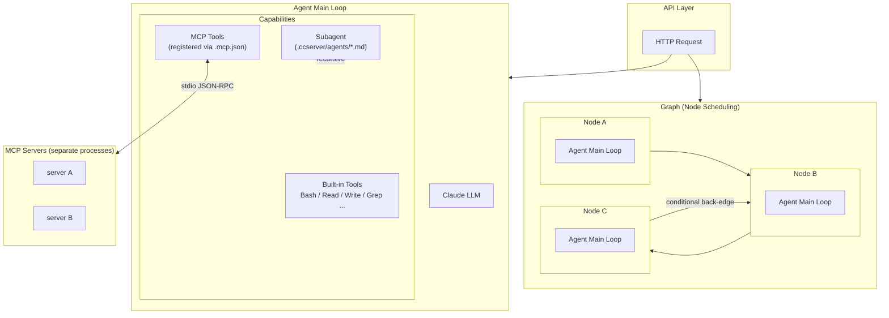

# CCServer — Wrapping Claude Code as a Deployable Agent Service

[简体中文](README.md) | English

> **This is NOT the source code of Claude Code. This is NOT the source code of Claude Code. This is NOT the source code of Claude Code.** Important things need to be said three times.
>
> CCServer started as a learning project — by intercepting real requests from Claude Code to the Anthropic API, analyzing its system prompts, tool definitions, message structures and other parameters, reverse-engineering the internal mechanism and reimplementing it from scratch (thanks to [shareAI-lab/learn-claude-code](https://github.com/shareAI-lab/learn-claude-code) for their analysis and research). Built on top of that, CCServer strips away the CLI shell and turns the core capabilities into a self-hosted Agent service, supporting HTTP API, SSE streaming, WebSocket, and a terminal UI.
>
> ⚠️ **This project is still in early stage. Some Claude Code mechanisms are not fully compatible yet and bugs may exist, but it will be actively maintained.** Issues and PRs are welcome.

---

## Use Cases

After using Claude Code for a while, you may find that many Agent projects don't require writing code at all — just write a good prompt and configure a few MCP tools, and a feature is ready. But Claude Code itself is a CLI tool that depends on the terminal, which can be limiting in certain scenarios:

- You want to expose Agent capabilities as an API and integrate it into a web app or automation pipeline
- You want to centrally manage prompts, MCP configs, and agent definitions and run them as a service
- The CLI approach is cumbersome for certain interaction patterns

If you have similar needs, this project might be worth trying.

If your workflow is relatively fixed, you can also try **Graph mode** to orchestrate multiple Agent nodes — each node is a complete Claude Agent, executed along edges with support for conditional back-edges, suitable for multi-step collaboration or retry loops.

---

## Quick Start

```bash
conda activate ccserver
uv pip install -r requirements.txt
export ANTHROPIC_API_KEY=your_key
```

The project has four entry points in two categories:

**Standalone (no other service required)**

```bash
# Backend API service (HTTP / SSE / WebSocket)
python server.py

# Terminal direct mode (bypasses server.py, calls Agent directly)
python tui.py
```

**Clients (requires server.py running first)**

```bash
# Gradio GUI
python clients/gui.py

# HTTP terminal UI (for testing the API)
python clients/tui_http.py
```

> Recommended: use [`just`](https://github.com/casey/just) to manage common commands: `just api` / `just tui` / `just gui` / `just tui-http`
>
> Install just: `brew install just` (macOS) / `apt install just` (Linux) / `winget install Casey.Just` (Windows)

---

## Speculation on Claude Code Internals

The following is a speculative reconstruction of Claude Code's internal mechanisms based on intercepted API calls. **All speculation — not official information.**

### Agent Loop

The core of Claude Code is a standard tool_use loop — no magic:

```
User input
  → Build messages list (with history)
  → Call Anthropic API (messages + tools + system)
  → stop_reason == "tool_use"  → Execute tool → Append tool_result → Continue
  → stop_reason == "end_turn"  → Output text → Wait for next user input
```

### System Prompt Structure

The system prompt is not a single large string, but a **`content` block array** (`List[dict]`) injected in multiple segments:

- **Identity declaration**: What Claude is, basic behavioral guidelines
- **Tool instructions**: Purpose and usage rules for each tool (separate from the `tools` field, supplemented in natural language)
- **Workflow**: Thinking steps and process rules for task execution
- **Environment injection (reminders)**: Dynamically appended before each user message — current time, working directory, system info, CLAUDE.md content, permission settings, etc.

### Tool Definitions

Claude Code's built-in tools (Bash, Read, Write, Edit, Glob, Grep, etc.) are passed via the standard `tools` parameter, defined exactly the same way as regular tool_use. Tool descriptions are very detailed, including usage notes and counterexamples to guide the model toward correct tool and parameter choices.

### Context Compression

When a conversation gets too long, Claude Code makes a separate LLM call to generate a summary, replacing history messages with the compressed summary block while keeping the most recent few turns intact. The full conversation before compression is archived (corresponding to `transcripts/` in this project).

### Subagents

Claude Code spawns subagents via special tool signals. Each subagent has its own independent messages list and tool set, and returns its result as a tool_result to the parent agent when done. Subagents do not share the parent's message history, and maximum nesting depth is limited.

### Skills and CLAUDE.md

- **CLAUDE.md**: Injected into the system prompt via reminders before each request, serving as project-level context
- **Skills**: On-demand Markdown documents injected into the message stream via tool calls, rather than pre-loaded into the system prompt — to save tokens

### Session Persistence

Each message is appended to disk in JSONL format, allowing recovery from the last checkpoint after a crash. Each session has an isolated sandbox working directory, and the Agent's file operations are confined within it.

---

## Project Structure

```
ccserver/                   # Project root
├── server.py               # Backend service (HTTP / SSE / WebSocket)
├── tui.py                  # Terminal direct mode (no server.py needed)
├── clients/
│   ├── gui.py              # Gradio GUI (requires server.py)
│   └── tui_http.py         # HTTP terminal UI (requires server.py)
├── Justfile                # Common commands (just api / tui / gui / tui-http)
├── requirements.txt        # Dependencies
└── ccserver/               # Source package
    ├── main.py             # AgentRunner public entry point
    ├── agent.py            # Agent and AgentContext core
    ├── session.py          # Session, TaskManager, SkillLoader
    ├── factory.py          # AgentFactory
    ├── config.py           # Global configuration
    ├── compactor.py        # Conversation compression
    ├── log.py              # Logging configuration
    ├── model/              # Model adapters (ModelAdapter / AnthropicAdapter)
    ├── prompts_lib/        # Prompt assembly library (multi-lib support)
    │   ├── base.py         # PromptLib base class
    │   ├── adapter.py      # Auto-scan registry entry point
    │   └── cc_reverse/     # cc_reverse series implementation
    ├── tools/              # Built-in tool set
    ├── core/emitter/       # Event emitters (TUI / SSE / WebSocket)
    ├── mcp/                # MCP client management
    ├── storage/            # Storage adapters
    └── pipeline/           # Pipeline Graph execution engine
```

---

## Core Modules

### Agent (`ccserver/agent.py`)

Unified root/child agent class, distinguished by constructor parameters:

- `persist=True`: Root agent, messages persisted to disk
- `persist=False`: Child agent, messages in memory, discarded after session ends

**Core loop:**

```
Message list → LLM call → Collect response → Check stop_reason
  → tool_use: Execute tool → Append result → Continue loop
  → Other (end_turn): Extract text → Return
```

**Subagent recursion:** `spawn_child()` creates subagents, max nesting depth `MAX_DEPTH` (default 5).

---

### Session (`ccserver/session.py`)

Each session has an isolated sandbox working directory:

```
sessions/
└── {session_id}/
    ├── workdir/            # Sandbox directory for agent operations
    ├── messages.jsonl      # Message history (one per line)
    └── transcripts/        # Full conversation archive before compression
```

Integrated components:
- **TodoManager**: Up to 20 tasks, status: `pending` / `in_progress` / `completed`
- **SkillLoader**: Loads skill documents from `./skills/*/SKILL.md`

---

### Prompt Lib (`ccserver/prompts_lib/`)

Prompt assembly system supporting multiple lib types and versions. Each lib controls the following injection points:

| Method | Timing | Required |
|--------|--------|----------|
| `build_system()` | Agent creation, builds system prompt | Yes |
| `build_user_message()` | Before each user message is appended | No |
| `build_compact_messages()` | After conversation compression | No |
| `build_skill_catalog()` | Generates skill catalog text for injection | No |
| `build_command_message()` | Wraps `/command` calls as content blocks | No |
| `patch_tool_schemas()` | Post-processes tool schema list | No |

Switch via `CCSERVER_PROMPT_LIB` environment variable. Default: `cc_reverse:v2.1.81`.

**Custom Prompt Lib:**

**Step 1**: Inherit `PromptLib` in `prompts_lib/<lib_name>/<version>/lib.py`:

```python
from prompts_lib.base import PromptLib

class MyLibV100(PromptLib):

    def build_system(self, session, model, language, cch="",
                     injected_system=None, append_system=True, is_spawn=False) -> list:
        return [{"type": "text", "text": "You are an assistant."}]

    def build_user_message(self, text, session, context) -> list:
        return [{"type": "text", "text": text}]

    def build_compact_messages(self, summary, transcript_ref) -> list:
        return [
            {"role": "user",      "content": f"[Summary]\n{summary}"},
            {"role": "assistant", "content": "Understood. Continuing."},
        ]
```

> All methods except `build_system()` have default base class implementations — override only what you need.

**Step 2**: Create a `manifest.json` in the same directory:

```json
{
  "lib_id": "my_lib:v1.0.0",
  "class": "MyLibV100"
}
```

The framework auto-scans all `manifest.json` files on startup and registers them — no changes to existing files needed.

**Step 3**: Enable via environment variable:

```bash
CCSERVER_PROMPT_LIB=my_lib:v1.0.0 python server.py
```

> Directory names with dots can't be Python package names — use underscores for directories (`v1_0_0`), keep dots in lib_id (`v1.0.0`).

---

### Built-in Tools (`ccserver/tools/`)

| Tool | Description |
|------|-------------|
| Bash | Execute shell commands, supports timeout and background execution |
| Read | Read files with line numbers, supports offset / limit |
| Write | Write or overwrite files |
| Edit | Precise string replacement |
| Glob | File pattern matching, sorted by modification time |
| Grep | Regex search, returns line numbers and content |
| Compact | Manually trigger conversation compression |
| Agent | Spawn subagents for complex tasks (registered on demand via agent catalog) |
| TaskCreate | Create a task |
| TaskUpdate | Update task status |
| TaskGet | Get task details |
| TaskList | List all tasks |
| AskUserQuestion | Ask the user a question and wait for their answer |
| WebSearch | Web search (requires client) |
| WebFetch | Fetch web page content (requires client) |

**Extending tools:** Inherit `BaseTool` and implement `name`, `description`, `params`, `run()`.

---

### Context Compression (`ccserver/compactor.py`)

Three-level compression strategy to automatically manage token consumption in long conversations:

| Level | Trigger | Method |
|-------|---------|--------|
| micro | Every round, automatic | Truncate old tool results, keep `KEEP_RECENT` most recent intact |
| Threshold check | Exceeds `THRESHOLD` characters | Trigger full LLM compression |
| LLM compression | Manual or threshold | Call Claude to generate summary, archive full conversation to transcripts |

---

### Event System (`ccserver/core/emitter/`)

Unified `BaseEmitter` interface supporting multiple output backends:

| Class | Use |
|-------|-----|
| TUIEmitter | Colorized terminal output + loading spinner |
| SSEEmitter | Async queue buffering, Server-Sent Events |
| CollectEmitter | In-memory collection, HTTP non-streaming response |

**Event types:** `token` / `tool_start` / `tool_result` / `done` / `compact` / `error`

---

## API Reference (`server.py`)

### Session Management

```
POST   /sessions                    Create a session (optional session_id)
GET    /sessions                    List all sessions
GET    /sessions/{session_id}       Get session metadata
```

### Chat

```
POST   /chat                        Blocking request, returns complete response
POST   /chat/stream                 SSE streaming response
WS     /chat/ws                     WebSocket bidirectional communication
```

**Request format:**

`session_id` is passed via Header; if omitted, a new session is created automatically:

```http
POST /chat
X-Session-Id: <session_id>

{"message": "write a hello world"}
```

**SSE event format:**
```json
{"type": "token",       "content": "partial text"}
{"type": "tool_start",  "tool": "Bash", "preview": "ls -la"}
{"type": "tool_result", "tool": "Bash", "output": "..."}
{"type": "done",        "content": "complete final text"}
{"type": "error",       "message": "error message"}
```

---

## Terminal UI (`tui.py`)

Connect directly to Agent without starting `server.py`:

```bash
python tui.py
# or
just tui
```

Built-in commands:

| Command | Description |
|---------|-------------|
| `/clear` | Start a new session |
| `/session <id>` | Switch to an existing session |
| `/sessions` | List all sessions |
| `/workdir` | Show current working directory |

---

## Skills System

Create a subdirectory under `./skills/` and add a `SKILL.md` file to register a skill:

```markdown
---
name: my-skill
description: Brief description of the skill
tags: [tag1, tag2]
---

# Skill Content

Detailed instructions and usage...
```

Agents can load skill content on demand via the `LoadSkill` tool.

---

## Configuration (`ccserver/config.py`)

All configuration supports `CCSERVER_*` environment variable overrides.

| Config | Env Var | Default | Description |
|--------|---------|---------|-------------|
| `PROJECT_DIR` | `CCSERVER_PROJECT_DIR` | `.` (current dir) | **Agent working directory**. The framework loads `.ccserver/` (agents, skills, hooks, settings, etc.) from this directory, and Agent file operations are rooted here. Must be explicitly set when deploying `server.py`; `tui.py` defaults to the current directory. |
| `MODEL` | `CCSERVER_MODEL` | `claude-sonnet-4-6` | Claude model to use |
| `THRESHOLD` | `CCSERVER_THRESHOLD` | `50000` | Character threshold for full compression |
| `KEEP_RECENT` | `CCSERVER_KEEP_RECENT` | `3` | Tool results kept intact during micro compression |
| `MAIN_ROUND_LIMIT` | `CCSERVER_MAIN_ROUNDS` | `100` | Max loop rounds for root agent |
| `SUB_ROUND_LIMIT` | `CCSERVER_SUB_ROUNDS` | `30` | Max loop rounds for subagents |
| `MAX_DEPTH` | `CCSERVER_MAX_DEPTH` | `5` | Max subagent nesting depth |
| `SESSIONS_BASE` | `CCSERVER_SESSIONS_DIR` | `~/.ccserver/sessions` | Session data root directory |
| `LOG_DIR` | `CCSERVER_LOG_DIR` | `~/.ccserver/logs` | Log directory |
| `LOG_LEVEL` | `CCSERVER_LOG_LEVEL` | `DEBUG` | Log level |
| `PROMPT_LIB` | `CCSERVER_PROMPT_LIB` | `cc_reverse:v2.1.81` | Prompt assembly library |

---

## Project Config Directory (`.ccserver/`)

`.ccserver/` is the CCServer equivalent of Claude Code's `.claude/` directory — **you can directly copy and rename your `.claude/` directory to `.ccserver/` and it will work out of the box**. Place it under the directory specified by `CCSERVER_PROJECT_DIR` and the framework will load it automatically on startup.

```
.ccserver/
├── agents/             # Custom subagent definitions (*.md, same format as Claude Code agents)
├── skills/             # Skill documents (each subdirectory contains a SKILL.md)
├── hooks/              # Lifecycle hook scripts (*.py)
├── commands/           # Custom slash commands (*.md)
├── settings.json       # Permission settings (allowed_tools / denied_tools, etc.)
└── settings.local.json # Local overrides (gitignored, takes priority over settings.json)
```

The file formats in `agents/`, `skills/`, `hooks/`, and `commands/` are fully compatible with Claude Code.

---

## Architecture



**Agent mode**: Reproduces Claude Code's main loop. An Agent autonomously makes decisions, calls tools in a loop, and can recursively spawn subagents via the `Agent` tool — each subagent is itself a complete main loop. This is the core of the framework, corresponding to Claude Code's single-instance mode.

**Graph mode**: Composes multiple independent Agent main loops in a graph. Each node is a complete Claude Code main Agent; nodes execute in edge order, with the previous node's output fed as input to the next. Cycles (conditional back-edges) are allowed but must define an exit condition to avoid infinite loops. Graph requires developers to inherit `Pipeline` and define their own API entry point to drive execution — suitable for fixed orchestration workflows or complex multi-agent scenarios with retry logic.

---

## Dependencies

**Core:**
```
anthropic>=0.40.0          # Anthropic API client
fastapi>=0.115.0           # HTTP / SSE / WebSocket server
uvicorn[standard]>=0.32.0  # ASGI server
pydantic>=2.0.0            # Data validation
loguru>=0.7.0              # Logging
python-dotenv>=0.21.0      # .env file loading
httpx>=0.24.0              # HTTP client (WebFetch tool / clients/)
html2text>=2020.1.16       # HTML to Markdown (WebFetch tool)
```

**SQLite storage backend**: Python standard library, no install needed.

**Optional** (install as needed):
```
mcp       # MCP tool support
gradio    # clients/gui.py GUI
motor     # MongoDB storage backend (async driver)
pymongo   # MongoDB storage backend
redis     # Redis cache (used with MongoDB)
```

---

## Playground

`playground/` contains complete examples built with this framework, organized into two directories:

> **Note**: `roleplay_agent` and `simple_roleplay_graph` implement the same roleplay conversation feature using two different approaches — the former uses a single Agent for orchestration (LLM autonomously schedules all subagents), while the latter uses a Graph to explicitly connect and orchestrate nodes. You can compare both approaches side by side.

```
playground/
├── agents/                         # Standalone Agent examples (reusable as subagents)
│   ├── web_search/                 # Web search Agent
│   ├── roleplay_agent/             # Roleplay orchestration Agent
│   ├── quality_check/              # Conversation quality check Agent
│   └── topic_suggest/              # Topic suggestion Agent
└── graphs/                         # Graph orchestration examples
    └── simple_roleplay_graph/      # Roleplay conversation Graph
```

### Agents

Standalone Agent examples, each runnable directly or reusable as a subagent by other Agents or Graphs.

**web_search** — Decides whether to search the web, executes the search, filters by time, and distills results. Depends on MCP tools: `search_web`, `search_news`, `get_weather`.

**roleplay_agent** — Uses Claude as the orchestration core to drive an independent chat model for roleplay conversations.

- **Dual-model design**: Claude handles orchestration (search, memory, quality control); a separate chat model (OpenAI-compatible) generates replies
- **Parallel scheduling**: Each turn launches web-search, profile-sync and other subagents concurrently, then assembles results before generating
- **Quality control loop**: Built-in quality-check subagent, auto-retries on failure, up to 3 times
- **Memory system**: User profile (structured slots) + user memory (unstructured) + dynamic persona settings, all file-persisted
- **History compression**: Compresses to summary in background when conversation exceeds threshold

**quality_check**, **topic_suggest**: Used as agents inside simple_roleplay_graph.

---

### Graphs

Graph orchestration examples showing how to use Pipeline to compose multiple Agents into a complex flow with conditional back-edges and a custom API entry point.

**simple_roleplay_graph** — Orchestrates web_search, topic_suggest, roleplay_agent, and quality_check in a Graph with a quality control back-edge.

Node order: `web_search → topic_suggest → prepare_chat → chat_call → quality_check → parse_qc`. When quality check fails, it loops back to prepare_chat with a reflection. See `README.md` for the full flow diagram.

---

## Support This Project

If this project has been helpful or inspiring to you, feel free to give it a ⭐ Star — it's the most direct way to support the project.

---

## Acknowledgements

- [shareAI-lab/learn-claude-code](https://github.com/shareAI-lab/learn-claude-code) — Analysis and research on Claude Code's internal mechanisms, which provided important reference for this project

---

> Parts of the code and documentation in this project were generated with AI assistance.
