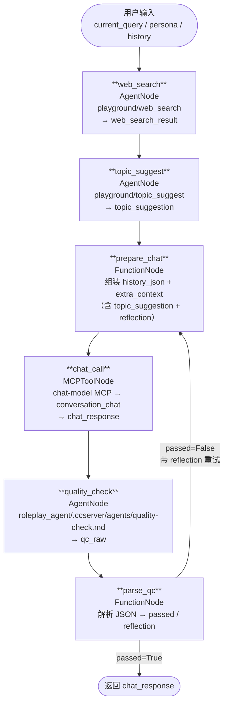

# PersonaChatGraph 执行流程

## 流程图



## 节点说明

| 节点 | 类型 | 来源 | 输出字段 |
|------|------|------|----------|
| `web_search` | AgentNode | `playground/web_search` | `web_search_result` |
| `topic_suggest` | AgentNode | `playground/topic_suggest / topic-suggest.md` | `topic_suggestion` |
| `prepare_chat` | FunctionNode | — | `history_json`, `extra_context` |
| `chat_call` | MCPToolNode | `chat-model` MCP → `conversation_chat` | `chat_response` |
| `quality_check` | AgentNode | `roleplay_agent/.ccserver/agents/quality-check.md` | `qc_raw` |
| `parse_qc` | FunctionNode | — | `passed`, `reflection` |

## 数据流

```
初始输入:
  current_query      用户消息
  persona            人设文本
  history_str        格式化历史（供 Agent 阅读）
  history_list       原始历史列表（供 prepare_chat 转 JSON）
  reflection         ""（初始为空，重试时由 parse_qc 填入）
  web_search_result  ""（初始为空）

重试时额外携带:
  reflection         quality_check 给出的具体修复建议
```
